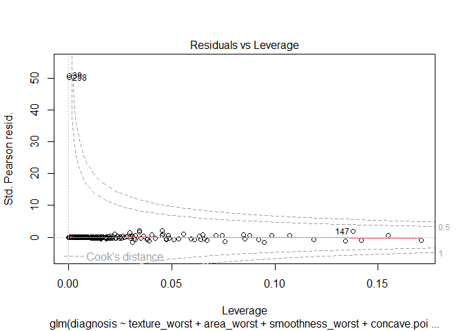

Breast_Cancer_Logistic
================

**Problem Statement:**

The study is focused on **“Examining the Influence of Smoothness,
Texture, Concave Points, and Area on Breast Cancer Detection.”**

**Data Summary:**

The Breast Cancer Wisconsin dataset consists of 569 patient test results
obtained from a digitized image of a fine needle aspirate (FNA) of the
breast. Each entry in the dataset provides information about the radius,
texture, perimeter, area, smoothness, compactness, concavity, concave
points, symmetry, fractal dimension, and diagnosis of the patient. The
features are categorized into three classes: mean, standard error, and
worst (which represents the mean of the three largest values), resulting
in a total of 30 features and 1 diagnosis feature. Out of 31 features we
need 5 important variables.

Initially, we selected the 10 variables with the worst class
designation. From those, we further narrowed down our selection to 4
predictor variables using various methods such as examining Pearson
correlations, forward and backward variable elimination, and VIF values.
We now have a set of 4 predictor variables and 1 outcome variable for
our analysis. It is important to note that we verified the absence of
missing values and outliers in the selected variables. Below are the
summary statistics of the variables we have chosen. All the factors that
are used to predict the outcome can be classified as either categories
or numerical values, while the outcome itself is a binary category.

``` r
knitr::opts_chunk$set(echo = TRUE)
library(dplyr)
library(tidyverse)
library(ggplot2)
library(knitr)
library(kableExtra)
library(car)
```

``` r
#Import dataset 
b_cancer <- read.csv("data.csv")
b_cancer <- subset(b_cancer,select = -c(id,X))
b_cancer$diagnosis <- factor(b_cancer$diagnosis,levels = c("B","M"))
# Checking missing values
b_cancer.missing <- b_cancer %>% summarise_all(~sum(is.na(.)))
kable(b_cancer.missing)
```

<table>
<thead>
<tr>
<th style="text-align:right;">
diagnosis
</th>
<th style="text-align:right;">
radius_mean
</th>
<th style="text-align:right;">
texture_mean
</th>
<th style="text-align:right;">
perimeter_mean
</th>
<th style="text-align:right;">
area_mean
</th>
<th style="text-align:right;">
smoothness_mean
</th>
<th style="text-align:right;">
compactness_mean
</th>
<th style="text-align:right;">
concavity_mean
</th>
<th style="text-align:right;">
concave.points_mean
</th>
<th style="text-align:right;">
symmetry_mean
</th>
<th style="text-align:right;">
fractal_dimension_mean
</th>
<th style="text-align:right;">
radius_se
</th>
<th style="text-align:right;">
texture_se
</th>
<th style="text-align:right;">
perimeter_se
</th>
<th style="text-align:right;">
area_se
</th>
<th style="text-align:right;">
smoothness_se
</th>
<th style="text-align:right;">
compactness_se
</th>
<th style="text-align:right;">
concavity_se
</th>
<th style="text-align:right;">
concave.points_se
</th>
<th style="text-align:right;">
symmetry_se
</th>
<th style="text-align:right;">
fractal_dimension_se
</th>
<th style="text-align:right;">
radius_worst
</th>
<th style="text-align:right;">
texture_worst
</th>
<th style="text-align:right;">
perimeter_worst
</th>
<th style="text-align:right;">
area_worst
</th>
<th style="text-align:right;">
smoothness_worst
</th>
<th style="text-align:right;">
compactness_worst
</th>
<th style="text-align:right;">
concavity_worst
</th>
<th style="text-align:right;">
concave.points_worst
</th>
<th style="text-align:right;">
symmetry_worst
</th>
<th style="text-align:right;">
fractal_dimension_worst
</th>
</tr>
</thead>
<tbody>
<tr>
<td style="text-align:right;">
0
</td>
<td style="text-align:right;">
0
</td>
<td style="text-align:right;">
0
</td>
<td style="text-align:right;">
0
</td>
<td style="text-align:right;">
0
</td>
<td style="text-align:right;">
0
</td>
<td style="text-align:right;">
0
</td>
<td style="text-align:right;">
0
</td>
<td style="text-align:right;">
0
</td>
<td style="text-align:right;">
0
</td>
<td style="text-align:right;">
0
</td>
<td style="text-align:right;">
0
</td>
<td style="text-align:right;">
0
</td>
<td style="text-align:right;">
0
</td>
<td style="text-align:right;">
0
</td>
<td style="text-align:right;">
0
</td>
<td style="text-align:right;">
0
</td>
<td style="text-align:right;">
0
</td>
<td style="text-align:right;">
0
</td>
<td style="text-align:right;">
0
</td>
<td style="text-align:right;">
0
</td>
<td style="text-align:right;">
0
</td>
<td style="text-align:right;">
0
</td>
<td style="text-align:right;">
0
</td>
<td style="text-align:right;">
0
</td>
<td style="text-align:right;">
0
</td>
<td style="text-align:right;">
0
</td>
<td style="text-align:right;">
0
</td>
<td style="text-align:right;">
0
</td>
<td style="text-align:right;">
0
</td>
<td style="text-align:right;">
0
</td>
</tr>
</tbody>
</table>

``` r
#selecting variables
b_cancer1 <- b_cancer[,22:31] 
b_cancer1$diagnosis <- b_cancer$diagnosis


#pearson correlation
b_cancer2 <- b_cancer1
b_cancer2$diagnosis <- ifelse(b_cancer2$diagnosis=="M",1,0)
b_cancer2$diagnosis <- as.integer(b_cancer2$diagnosis)
cor_tb <- round(cor(b_cancer2,method = "pearson"),digits = 4)
cor_tb
```

    ##                         radius_worst texture_worst perimeter_worst area_worst
    ## radius_worst                  1.0000        0.3599          0.9937     0.9840
    ## texture_worst                 0.3599        1.0000          0.3651     0.3458
    ## perimeter_worst               0.9937        0.3651          1.0000     0.9776
    ## area_worst                    0.9840        0.3458          0.9776     1.0000
    ## smoothness_worst              0.2166        0.2254          0.2368     0.2091
    ## compactness_worst             0.4758        0.3608          0.5294     0.4383
    ## concavity_worst               0.5740        0.3684          0.6183     0.5433
    ## concave.points_worst          0.7874        0.3598          0.8163     0.7474
    ## symmetry_worst                0.2435        0.2330          0.2695     0.2091
    ## fractal_dimension_worst       0.0935        0.2191          0.1390     0.0796
    ## diagnosis                     0.7765        0.4569          0.7829     0.7338
    ##                         smoothness_worst compactness_worst concavity_worst
    ## radius_worst                      0.2166            0.4758          0.5740
    ## texture_worst                     0.2254            0.3608          0.3684
    ## perimeter_worst                   0.2368            0.5294          0.6183
    ## area_worst                        0.2091            0.4383          0.5433
    ## smoothness_worst                  1.0000            0.5682          0.5185
    ## compactness_worst                 0.5682            1.0000          0.8923
    ## concavity_worst                   0.5185            0.8923          1.0000
    ## concave.points_worst              0.5477            0.8011          0.8554
    ## symmetry_worst                    0.4938            0.6144          0.5325
    ## fractal_dimension_worst           0.6176            0.8105          0.6865
    ## diagnosis                         0.4215            0.5910          0.6596
    ##                         concave.points_worst symmetry_worst
    ## radius_worst                          0.7874         0.2435
    ## texture_worst                         0.3598         0.2330
    ## perimeter_worst                       0.8163         0.2695
    ## area_worst                            0.7474         0.2091
    ## smoothness_worst                      0.5477         0.4938
    ## compactness_worst                     0.8011         0.6144
    ## concavity_worst                       0.8554         0.5325
    ## concave.points_worst                  1.0000         0.5025
    ## symmetry_worst                        0.5025         1.0000
    ## fractal_dimension_worst               0.5111         0.5378
    ## diagnosis                             0.7936         0.4163
    ##                         fractal_dimension_worst diagnosis
    ## radius_worst                             0.0935    0.7765
    ## texture_worst                            0.2191    0.4569
    ## perimeter_worst                          0.1390    0.7829
    ## area_worst                               0.0796    0.7338
    ## smoothness_worst                         0.6176    0.4215
    ## compactness_worst                        0.8105    0.5910
    ## concavity_worst                          0.6865    0.6596
    ## concave.points_worst                     0.5111    0.7936
    ## symmetry_worst                           0.5378    0.4163
    ## fractal_dimension_worst                  1.0000    0.3239
    ## diagnosis                                0.3239    1.0000

``` r
# froward and backward variable elimination
album.model.none = glm(diagnosis~1,data = b_cancer2,family = binomial())
album.model1 = glm(diagnosis~.,data = b_cancer2,family = binomial())
model_both <- step(album.model.none,direction = "both", scope = list(lower=album.model.none,upper=album.model1), trace = 0)
summary(model_both)
```

    ## 
    ## Call:
    ## glm(formula = diagnosis ~ smoothness_worst + texture_worst + 
    ##     concave.points_worst + area_worst, family = binomial(), data = b_cancer2)
    ## 
    ## Deviance Residuals: 
    ##     Min       1Q   Median       3Q      Max  
    ## -1.5629  -0.0663  -0.0095   0.0012   3.9648  
    ## 
    ## Coefficients:
    ##                        Estimate Std. Error z value Pr(>|z|)    
    ## (Intercept)          -30.369828   4.497012  -6.753 1.44e-11 ***
    ## smoothness_worst      49.780865  18.891431   2.635  0.00841 ** 
    ## texture_worst          0.277444   0.056411   4.918 8.73e-07 ***
    ## concave.points_worst  36.958658  11.313930   3.267  0.00109 ** 
    ## area_worst             0.013987   0.002264   6.178 6.50e-10 ***
    ## ---
    ## Signif. codes:  0 '***' 0.001 '**' 0.01 '*' 0.05 '.' 0.1 ' ' 1
    ## 
    ## (Dispersion parameter for binomial family taken to be 1)
    ## 
    ##     Null deviance: 751.440  on 568  degrees of freedom
    ## Residual deviance:  89.898  on 564  degrees of freedom
    ## AIC: 99.898
    ## 
    ## Number of Fisher Scoring iterations: 9

``` r
#selectting important variables
b_cancer <- b_cancer2 %>% dplyr::select(smoothness_worst,texture_worst,concave.points_worst,area_worst,diagnosis)
b_cancer %>% ggplot(aes(seq(smoothness_worst),smoothness_worst)) + geom_boxplot()
```

<!-- -->

``` r
b_cancer %>% ggplot(aes(seq(texture_worst),texture_worst)) + geom_boxplot()
```

<!-- -->

``` r
b_cancer %>% ggplot(aes(seq(concave.points_worst),concave.points_worst)) + geom_boxplot()
```

<!-- -->

``` r
b_cancer %>% ggplot(aes(seq(area_worst),area_worst)) + geom_boxplot()
```

<!-- -->

``` r
summary(b_cancer)
```

    ##  smoothness_worst  texture_worst   concave.points_worst   area_worst    
    ##  Min.   :0.07117   Min.   :12.02   Min.   :0.00000      Min.   : 185.2  
    ##  1st Qu.:0.11660   1st Qu.:21.08   1st Qu.:0.06493      1st Qu.: 515.3  
    ##  Median :0.13130   Median :25.41   Median :0.09993      Median : 686.5  
    ##  Mean   :0.13237   Mean   :25.68   Mean   :0.11461      Mean   : 880.6  
    ##  3rd Qu.:0.14600   3rd Qu.:29.72   3rd Qu.:0.16140      3rd Qu.:1084.0  
    ##  Max.   :0.22260   Max.   :49.54   Max.   :0.29100      Max.   :4254.0  
    ##    diagnosis     
    ##  Min.   :0.0000  
    ##  1st Qu.:0.0000  
    ##  Median :0.0000  
    ##  Mean   :0.3726  
    ##  3rd Qu.:1.0000  
    ##  Max.   :1.0000

**Model Assumptions: COMPLETE SEPARATION**

There is complete information i.e., a full combination of variables.
There is an overlap of data as seen in below plots, thus there is no
problem of complete separation.

``` r
#complete separation
b_cancer %>% ggplot(aes(x=area_worst,y=diagnosis)) + geom_jitter(width = 0.1,height = 0.1,color="blue") + stat_smooth(method = "glm",color = "red", method.args = list(family=binomial),se = FALSE) + ylim(-0.5,1.5) 
```

<!-- -->

``` r
b_cancer %>% ggplot(aes(x=smoothness_worst,y=diagnosis)) + geom_jitter(width = 0.1,height = 0.1,color="blue") + stat_smooth(method = "glm",color = "red", method.args = list(family=binomial),se = FALSE) + ylim(-0.5,1.5)
```

<!-- -->

``` r
b_cancer %>% ggplot(aes(x=texture_worst,y=diagnosis)) + geom_jitter(width = 0.1,height = 0.1,color="blue") + stat_smooth(method = "glm",color = "red", method.args = list(family=binomial),se = FALSE) + ylim(-0.5,1.5)
```

<!-- -->

``` r
b_cancer %>% ggplot(aes(x=concave.points_worst,y=diagnosis)) + geom_jitter(width = 0.01,height = 0.1,color="blue") + stat_smooth(method = "glm",color = "red", method.args = list(family=binomial),se = FALSE) + ylim(-0.5,1.5)
```

<!-- -->

**LOGISTIC REGRESSION MODEL**

We perform a logistic regression analysis on 4 predictor variables to
predict whether the patient’s breast cancer diagnosis result is either
benign (B,0) or malignant (M,1).

``` r
#model main
album.model <- glm(formula = diagnosis ~ texture_worst + area_worst + smoothness_worst + concave.points_worst, family = binomial(), data = b_cancer)
summary(album.model)
```

    ## 
    ## Call:
    ## glm(formula = diagnosis ~ texture_worst + area_worst + smoothness_worst + 
    ##     concave.points_worst, family = binomial(), data = b_cancer)
    ## 
    ## Deviance Residuals: 
    ##     Min       1Q   Median       3Q      Max  
    ## -1.5629  -0.0663  -0.0095   0.0012   3.9648  
    ## 
    ## Coefficients:
    ##                        Estimate Std. Error z value Pr(>|z|)    
    ## (Intercept)          -30.369828   4.497012  -6.753 1.44e-11 ***
    ## texture_worst          0.277444   0.056411   4.918 8.73e-07 ***
    ## area_worst             0.013987   0.002264   6.178 6.50e-10 ***
    ## smoothness_worst      49.780865  18.891431   2.635  0.00841 ** 
    ## concave.points_worst  36.958658  11.313930   3.267  0.00109 ** 
    ## ---
    ## Signif. codes:  0 '***' 0.001 '**' 0.01 '*' 0.05 '.' 0.1 ' ' 1
    ## 
    ## (Dispersion parameter for binomial family taken to be 1)
    ## 
    ##     Null deviance: 751.440  on 568  degrees of freedom
    ## Residual deviance:  89.898  on 564  degrees of freedom
    ## AIC: 99.898
    ## 
    ## Number of Fisher Scoring iterations: 9

``` r
#plot check
plot(album.model)
```

<!-- --><!-- --><!-- --><!-- -->

**Model Assumption: MULTICOLLINEARITY**

we can observe that the highest Variance Inflation Factor (VIF) is below
10, the average VIF is close to 1, and the lowest tolerance value is
greater than both 0.1 (indicating a serious problem) and 0.2 (indicating
a potential problem). Based on these results, we can conclude that there
is no significant issue of multicollinearity within the data.

``` r
#Assumptions

#multicollinearity
vif(album.model)
```

    ##        texture_worst           area_worst     smoothness_worst 
    ##             1.404183             1.775587             2.030334 
    ## concave.points_worst 
    ##             1.609457

``` r
tolerance = 1/vif(album.model)
tolerance
```

    ##        texture_worst           area_worst     smoothness_worst 
    ##            0.7121578            0.5631941            0.4925297 
    ## concave.points_worst 
    ##            0.6213275

``` r
mean(vif(album.model))
```

    ## [1] 1.70489

**Model Assumption: INDEPENDENT RESIDUALS**

To assess the independence of residuals, the Durbin-Watson test is
employed. Looking at the values, we can observe that they are close to
2. This suggests that, at a 5% level of significance, we can accept the
null hypothesis of the Durbin-Watson test, which implies that there is
no autocorrelation among the residuals. Therefore, the assumption of
independence is met.

``` r
#Assumptions

#independence of residuals
durbinWatsonTest(album.model)
```

    ##  lag Autocorrelation D-W Statistic p-value
    ##    1      0.05592464      1.888151   0.596
    ##  Alternative hypothesis: rho != 0

**Model Assumption: INFLUENTIAL POINTS**

In order to identify influential cases, we calculated Cook’s distance
for the model. Upon analysis, we found that the maximum Cook’s distance
value was significantly less than 1. Hence, we can conclude that there
are no influential cases exerting a substantial impact on the model.

``` r
#Assumptions

#checking influence points
b_cancer2 <- b_cancer
b_cancer2$cd <- cooks.distance(album.model)
plot(sort(b_cancer2$cd , decreasing=TRUE))
```

<!-- -->

``` r
max(b_cancer2$cd)
```

    ## [1] 0.2702139

**Model Assumption: OUTLIERS**

To detect outliers, we examined the standardized residuals and
determined their range within the 95% confidence interval. Our analysis
revealed that only two residuals in the model exceeded the threshold of
1.96 standard deviations. Consequently, we did not identify any of these
observations as outliers.

``` r
#Assumptions

# outliers residual
b_cancer2$fitted <- album.model$fitted
b_cancer2$residuals <- album.model$residuals
b_cancer2$standardized.residuals <- rstandard(album.model)

possible.outliers2 <- subset(b_cancer2, standardized.residuals < -1.96 | standardized.residuals > 1.96)
possible.outliers2
```

    ##     smoothness_worst texture_worst concave.points_worst area_worst diagnosis
    ## 39           0.09387         25.20              0.02899      698.8         1
    ## 298          0.11370         23.39              0.07160      553.6         1
    ##            cd       fitted residuals standardized.residuals
    ## 39  0.2702139 0.0003859479  2591.023               3.965831
    ## 298 0.2199427 0.0003972228  2517.479               3.958392

**Model Assumption: LINEARITY**

To assess the assumption of linearity, we conducted a logistic
regression analysis by including interaction variables (e.g.,
\[variable\*log(variable)\]) for each predictor variable. After
examining the model, we determined that none of the interaction
variables exhibited significance (p\>0.05). Therefore, we accept the
assumption that the relationship between the variables is linear.

``` r
#Assumptions

# Linearity check
b_cancer2 <- b_cancer2 %>% mutate(log.smoothness_worst = log(smoothness_worst+1), log.texture_worst = log(texture_worst+1), log.concave.points_worst = log(concave.points_worst+1), log.area_worst = log(area_worst+1), inter.log.smoothness_worst = (smoothness_worst+1)*log(smoothness_worst+1), inter.log.texture_worst = (texture_worst+1)*log(texture_worst+1), inter.log.concave.points_worst = (concave.points_worst+1)*log(concave.points_worst+1), inter.log.area_worst = (area_worst+1)*log(area_worst+1))


album.model2 <- glm(formula = diagnosis ~ texture_worst + area_worst + smoothness_worst + 
    concave.points_worst + log.texture_worst + log.area_worst + log.smoothness_worst + 
    log.concave.points_worst + inter.log.texture_worst + inter.log.area_worst + inter.log.smoothness_worst + 
    inter.log.concave.points_worst , family = binomial(), data = b_cancer2)
summary(album.model2)
```

    ## 
    ## Call:
    ## glm(formula = diagnosis ~ texture_worst + area_worst + smoothness_worst + 
    ##     concave.points_worst + log.texture_worst + log.area_worst + 
    ##     log.smoothness_worst + log.concave.points_worst + inter.log.texture_worst + 
    ##     inter.log.area_worst + inter.log.smoothness_worst + inter.log.concave.points_worst, 
    ##     family = binomial(), data = b_cancer2)
    ## 
    ## Deviance Residuals: 
    ##     Min       1Q   Median       3Q      Max  
    ## -1.9860  -0.0632  -0.0052   0.0000   3.9661  
    ## 
    ## Coefficients:
    ##                                  Estimate Std. Error z value Pr(>|z|)
    ## (Intercept)                    -3.097e+02  6.968e+02  -0.445    0.657
    ## texture_worst                  -2.282e-01  4.002e+01  -0.006    0.995
    ## area_worst                     -3.530e-01  1.426e+00  -0.248    0.804
    ## smoothness_worst               -1.601e+05  2.948e+05  -0.543    0.587
    ## concave.points_worst           -1.013e+04  4.497e+04  -0.225    0.822
    ## log.texture_worst               2.836e+01  2.117e+02   0.134    0.893
    ## log.area_worst                  3.925e+01  1.307e+02   0.300    0.764
    ## log.smoothness_worst            8.540e+04  1.574e+05   0.542    0.587
    ## log.concave.points_worst        4.452e+03  2.349e+04   0.189    0.850
    ## inter.log.texture_worst        -1.146e-01  7.474e+00  -0.015    0.988
    ## inter.log.area_worst            4.170e-02  1.640e-01   0.254    0.799
    ## inter.log.smoothness_worst      7.539e+04  1.386e+05   0.544    0.586
    ## inter.log.concave.points_worst  5.561e+03  2.154e+04   0.258    0.796
    ## 
    ## (Dispersion parameter for binomial family taken to be 1)
    ## 
    ##     Null deviance: 751.440  on 568  degrees of freedom
    ## Residual deviance:  75.834  on 556  degrees of freedom
    ## AIC: 101.83
    ## 
    ## Number of Fisher Scoring iterations: 15

**Analysis**

After assessing all the assumptions of the logistic model, we analyzed
the model results as follows:

1.  All four predictor variables, along with the intercept, have a
    significant influence on the diagnosis at a 5% level of
    significance. The Akaike Information Criterion (AIC) value for the
    model is 99.898. The intercept itself has a significant effect on
    the diagnosis (z = -6.753, p \< 0.01) at a 5% level of significance.
2.  The odds ratio for the variable texture_worst is 1.319, indicating
    that the odds of being classified as “malignant” increase by 31.9%
    for every 1 unit increase in texture_worst. Similarly, the odds
    ratio for the variable area_worst is 1.014, implying that the odds
    of being classified as “malignant” increase by 1% for every 1 unit
    increase in area_worst.
3.  The odds ratios for the variables smoothness_worst and
    concave.points_worst are large values greater than 1, indicating
    that these variables have a strong effect on the diagnosis. However,
    interpreting the exact impact of these variables is challenging.

``` r
#odds ratio and its confidence intervals
exp(coefficients(album.model))
```

    ##          (Intercept)        texture_worst           area_worst 
    ##         6.464744e-14         1.319752e+00         1.014086e+00 
    ##     smoothness_worst concave.points_worst 
    ##         4.164423e+21         1.124453e+16

``` r
exp(confint(album.model))
```

    ##                             2.5 %       97.5 %
    ## (Intercept)          2.679544e-18 1.488493e-10
    ## texture_worst        1.191504e+00 1.490530e+00
    ## area_worst           1.010082e+00 1.019176e+00
    ## smoothness_worst     2.620855e+06 7.094440e+38
    ## concave.points_worst 1.098312e+07 3.078828e+26

Overall, the model suggests that the selected predictor variables
significantly contribute to predicting the diagnosis, with texture_worst
and area_worst demonstrating a more straightforward interpretation of
their effects.

The model predicted “malignant” for the following test data
\[texture_worst = 25.55, area_worst = 1710.0, smoothness_worst = 0.1234,
concave.points_worst = 0.17411\].

``` r
#prediction
test_data = tibble(texture_worst = 25.55, area_worst = 1710.0, smoothness_worst = 0.12340,concave.points_worst = 0.174110)
probs <- predict(album.model,newdata = test_data,type = "response")
prediction <- ifelse(probs>0.5,"malignant","benign")
prediction
```

    ##           1 
    ## "malignant"

**Conclusion:**

We constructed a logistic regression model to examine how certain
worst-class features (such as texture, area, smoothness, and concave
points) affect the diagnosis of breast cancer. After verifying that all
the assumptions of logistic regression were satisfied, we found that all
the chosen predictor variables significantly influenced the breast
cancer diagnosis.

Using the developed model, we made predictions for test data with the
following values: texture_worst = 25.55, area_worst = 1710.0,
smoothness_worst = 0.1234, and concave.points_worst = 0.17411. Based on
these predictions, the model classified the data as “malignant.”

From our analysis, we can conclude that the logistic regression model
provides reliable predictions for breast cancer diagnosis. Furthermore,
the selected predictor variables, including texture_worst, area_worst,
smoothness_worst, and concave.points_worst, have a significant impact on
detecting breast cancer.
